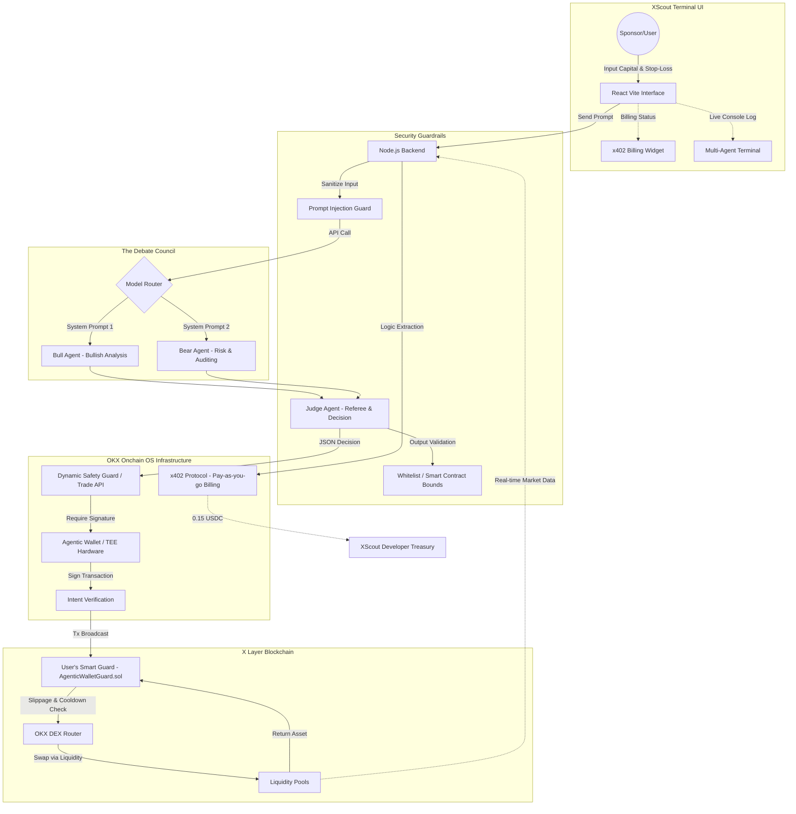

# XScout AI - Data Flow & Architecture

Project XScout AI (Model: 3-Agent Debate + Onchain OS + x402 Protocol)
Hackathon Goal: Deploying an Autonomous and Decentralized AI Financial Advisor natively on X Layer.

## 1. OVERALL ARCHITECTURE MODEL (MERMAID)

## 2. SECURITY POLICY & WORKFLOW

1. **Initialization & Connection:**
   - Users utilize the OKX Web3 Wallet to authorize operations or deposit budgets into the Agent's Smart Contract.
   - The Node.js Backend restructures user input enforcing strict role arrays, immediately isolating Prompt Injection risks.

2. **Real-time Ground Truth API:**
   - Before debating, the Backend queries the Onchain OS Market API to inject live TVL, Slippage, and Tax constraints directly into the AI's cognitive memory.

3. **The Debate Council:**
   - The **Bull** analyzes high-yield prospects. The **Bear** attacks those proposals looking for Impermanent Loss, Depegs, or Rugpull vulnerabilities.
   - The **Judge** synthesizes the arguments, assigns a Confidence Score, and structurally compiles a definitive strict JSON payload (SWAP, STAKE, or CANCEL).

4. **Accounting & Execution (x402 & RBAC):**
   - Win or lose, the x402 architecture deducts an inference Micro-payment directly from the sponsor wallet prior to execution.
   - Upon execution, the TEE (Trusted Execution Environment) blindly signs the transaction payload. The `Owner` wallet key remains disconnected and offline.
   - Any slippage anomalies or spam-rate violations are natively caught by the `AgenticWalletGuard` and immediately Reverted on the X Layer network.

5. **Proactive Alerts & Recovery:**
   - The system continuously crawls real-time position statuses and triggers Push Notifications via Telegram Bot specifically mapped to the user API.
   - In case of Server Compromise, the user leverages their disconnected Hardware Wallet to call `updateAIAgentRole` or `emergencyWithdrawal` natively on the Blockchain explorer, fully maintaining Zero-Trust fund sovereignty.
